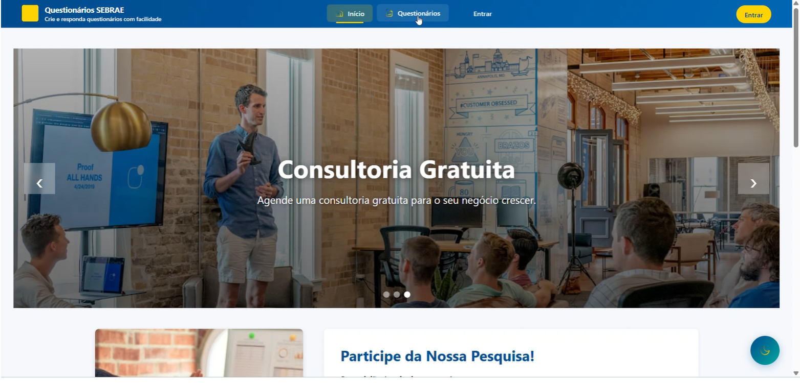
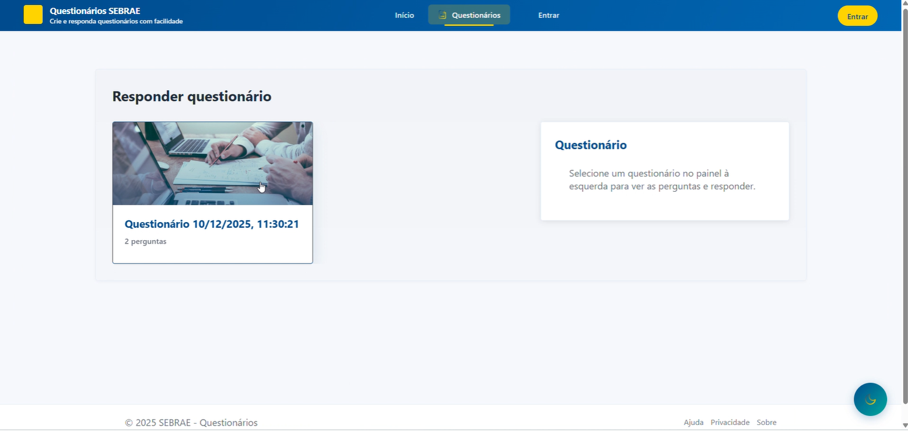
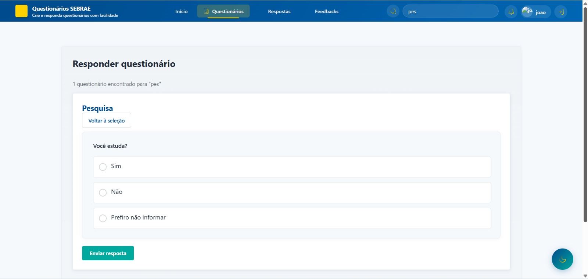
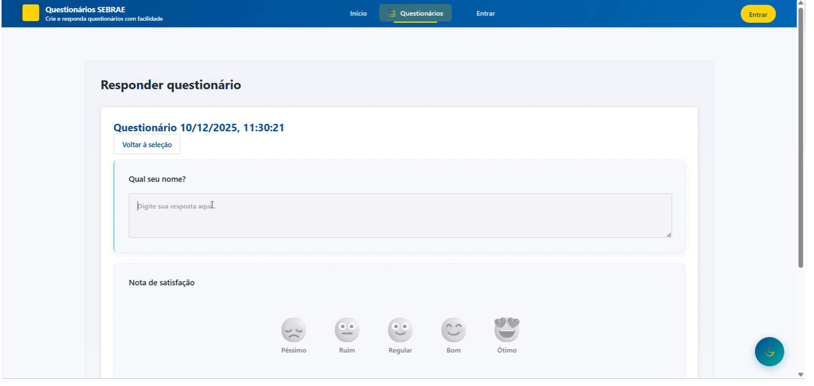
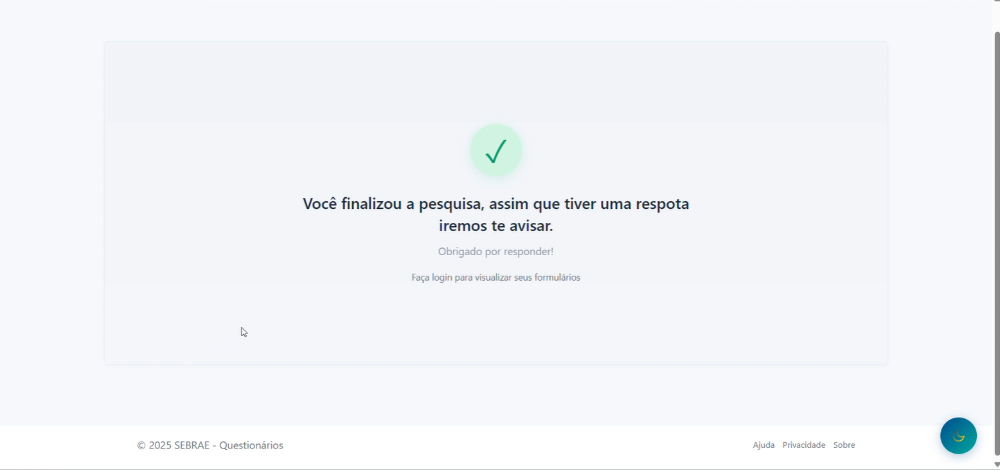
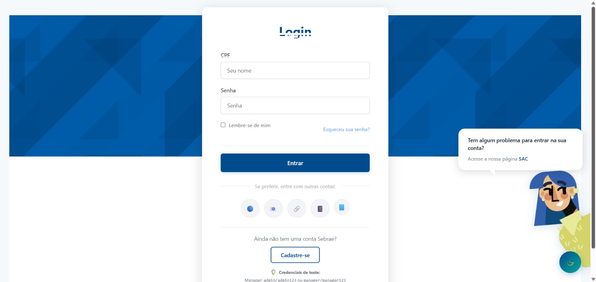
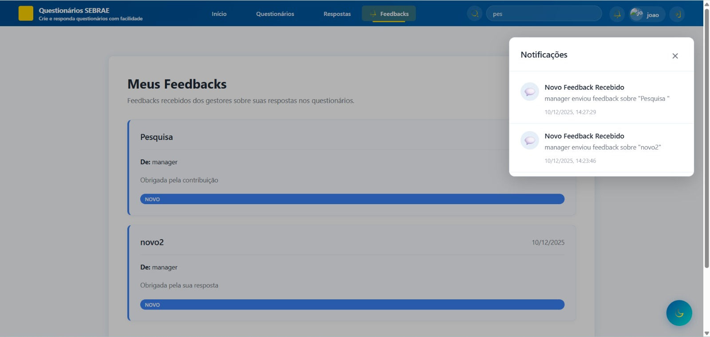
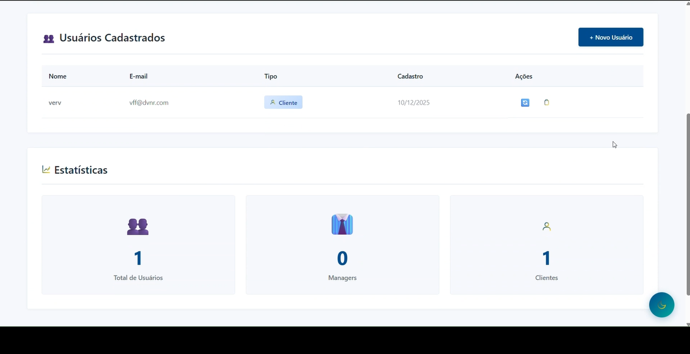
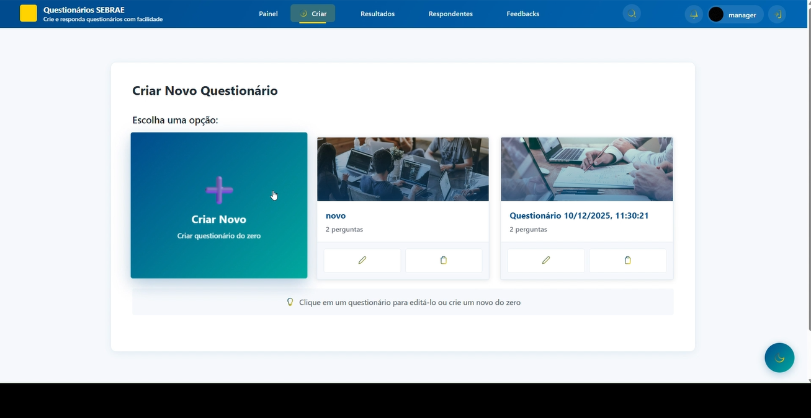
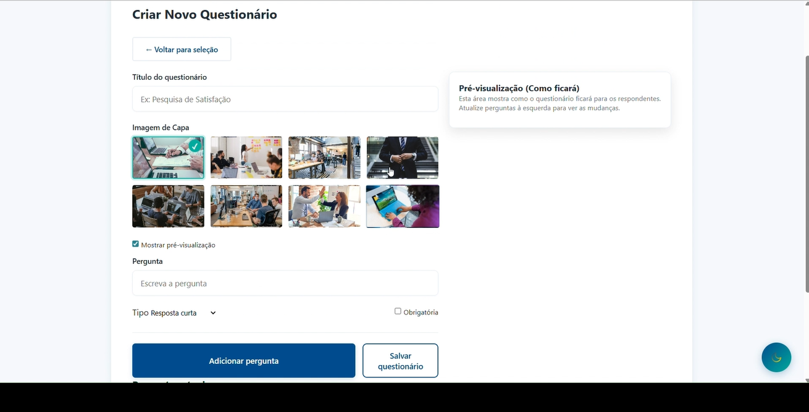

# PROJETO 3 - FOCUS

# 📊 Questionários SEBRAE  
Aplicação web para criação, gerenciamento e resposta de questionários, com diferentes perfis de acesso: Visitante, Cliente e Manager.  
O sistema foi desenvolvido para facilitar a coleta de dados, acompanhar feedbacks e organizar respostas de forma simples e intuitiva.

# 🚀 Como Rodar o Projeto

## Pré-requisitos
Certifique-se de ter instalado em sua máquina:
- [Docker](https://www.docker.com/products/docker-desktop)
- [Docker Compose](https://docs.docker.com/compose/install/)

## Execução com Docker

O projeto foi configurado para rodar completamente em containers, facilitando a execução em qualquer ambiente.

### Passos para executar:

1. **Clone o repositório** (se ainda não o fez):
   ```bash
   git clone https://github.com/gabrielvictalino/repo-projeto3.git
   cd repo-projeto3
   ```

2. **Suba ou construa os containers**:
   Na raiz do projeto (onde está o arquivo `docker-compose.yml`), execute:
   ```bash
   docker-compose up --build
   ```
   > Esse comando irá construir as imagens do backend e frontend, e iniciar o banco de dados MySQL.

3. **Acesse a aplicação**:
   - Frontend: [http://localhost:8000](http://localhost:8000) (Porta 8000)
   - Backend API: `http://localhost/api` (Acessível via proxy reverso do frontend)

4. **Parar a execução**:
   Para parar os serviços, pressione `Ctrl+C` no terminal ou execute:
   ```bash
   docker-compose down
   ```

### 🛠️ Comandos Úteis (Troubleshooting)

Caso encontre problemas durante a execução, utilize os comandos abaixo para diagnóstico e correção:

- **Ver logs em tempo real**:  
  Essencial para identificar erros no backend ou banco de dados.
  ```bash
  docker-compose logs -f
  # Ou para um serviço específico:
  docker-compose logs -f backend
  ```

- **Reiniciar os containers**:
  ```bash
  docker-compose restart
  ```

- **Forçar rebuild das imagens**:  
  Útil quando alterações no código ou dependências não são refletidas.
  ```bash
  docker-compose up --build
  ```

- **Limpar tudo (Resetar Banco de Dados)**:  
  **Atenção:** Isso apagará todos os dados salvos no banco.
  ```bash
  docker-compose down -v
  ```

## ⚙️ Configurações Importantes

- **Frontend**: Roda na porta 8000 e utiliza Nginx como servidor web e proxy reverso.
- **Backend**: Roda na porta 8080 (internamente) e conecta-se ao banco de dados `db`.
- **Database**: MySQL 8.0 rodando na porta 3307 (externamente) e 3306 (internamente).

---

## 👥 Integrantes do Projeto

### **Ciência da Computação**
- Aline Takakura
- Gabriel Victalino
- Julia Ventura
- Leonardo Gutzeit
- Luana Fernandes
- Marco Veras
- Matheus Araujo

### **Design**
- João Pedro Moura
- Karina Bandeira
- Leticia Pontes
- Pedro Luna  

---

## 🧩 Perfis e Fluxos de Uso

A seguir, uma visão geral da navegação realizada pelos três tipos de usuário.

---

# 👤 **Visitante**

Fluxo: **Página inicial → Seleção do questionário → Responder → Finalização**

### **Página Inicial**


### **Lista de Questionários**


### **Pergunta (Sim/Não)**


### **Pergunta (Campo texto + satisfação)**


### **Tela de Finalização**


---

# 🧑‍💼 **Cliente**

Fluxo:  
**Login → Buscar questionário → Responder → Notificações e Feedbacks**

### **Login**


### **Responder Questionário**


### **Feedbacks + Notificações**


---

# 🛠️ **Manager (Gestor)**

Fluxo:  
**Painel → Criar questionário → Resultados / Respondentes / Feedbacks**

### **Painel do Gestor**


### **Criar Novo Questionário**


### **Opções de Criação**


---

# 📌 Conclusão

O projeto **Questionários SEBRAE** demonstra uma solução completa para criação, gestão e resposta de questionários, integrando três perfis de uso distintos e fluxos bem definidos.  
A aplicação oferece uma experiência clara e intuitiva tanto para visitantes quanto para usuários autenticados, além de disponibilizar ao gestor um conjunto eficiente de ferramentas para acompanhamento das respostas e envio de feedbacks.  

O resultado final evidencia a integração entre design e desenvolvimento, refletindo uma interface moderna, funcional e alinhada aos objetivos propostos pelo projeto.
